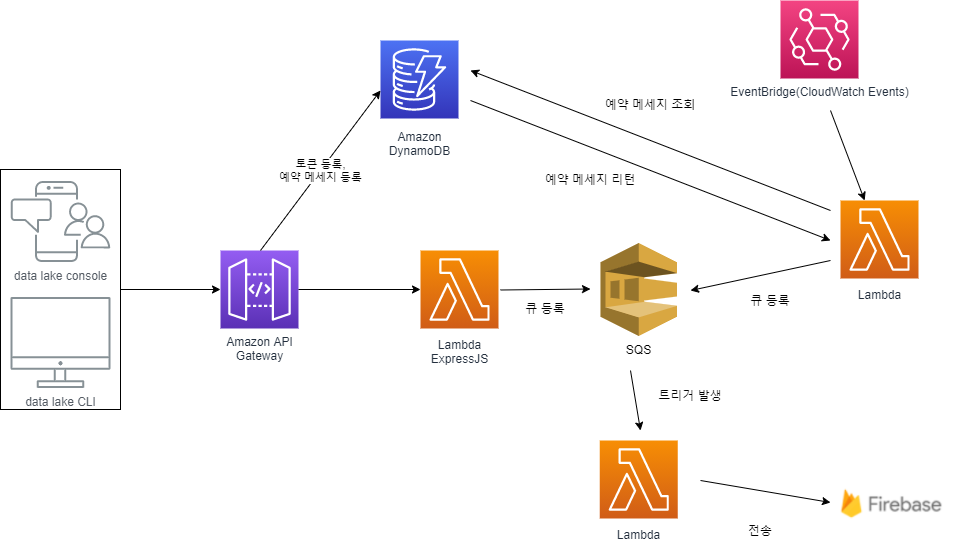

# WEB, APP PUSH 서버

Firebase notification 기반으로 쉽게 WEB, APP PUSH를 발생시킬수 있는 공용 서버

사용되는 리소스 자원
- lambda
- ApiGateway
- SQS
- dynamoDB
- ACM

# 설계



# 사용법

1. firebase에서 발급받은 server_key를 api서버에 등록한다. response로 고유값으로 쓸수 있는 client_key를 발급해준다 (재발급 X, 찾기 X) 무조건 잃어버렸을 경우 새로 생성해야한다.

  ```
  ex)
    POST
      domain/auth/sign
      {project: '프로젝트이름', server_key: 'fireBase에서 발급된 server_key'}
  ```

2. 개인의 토큰 을 등록한다.

```
  ex)
    POST
      domain/token
      {client_key: '클라이언트키', cid: '개인 unique identity', token: 'token'}
```

3. PUSH 발생, PUSH 예약

```
  즉시발생)
    POST
      domain/token
      {
        client_key: '클라이언트키',
        body: {
          send_type: 'token' OR 'topic'
          cid: '개인 unique identity'
          title: 'title'
          content: 'content'
          reservation: false
        }
      }
  예약발송)
    POST
      domain/token
      {
        client_key: '클라이언트키',
        body: {
          send_type: 'token' OR 'topic'
          cid: '개인 unique identity'
          title: 'title'
          content: 'content'
          reservation: true,
          time: '202107270230'
          //yyyymmddHHMM  람다 cron이 30분으로 배치 되어있어 시간을 변경하면 1분까지 컨트롤 가능
        }
      }
```

# 빌드 & 배포

1. template.yaml에 필요한 정보를 입력한다

```yaml  
  Parameters:
    allLayer:
      Type: String
      Description: zip layer arn
      Default: arn
    domainName:
      Type: String
      Description: domainName
      Default: domainName
    domainACM:
      Type: String
      Description: domainACM
      Default: domainACM
```
template.yaml에 바로입력 or `deploy --guided`시 입력

2. (선택)람다에서 사용될 Layer을 생성하여 관리할수 있다.

  ```cli
  ./nodejs/node_modules/*
  ```
  의 구조를 가진 nodejs.zip 파일로 압축해 레이어를 생성한다.
  ```cli
    aws lambda publish-layer-version --layer-name XXXXXX --zip-file fileb://nodejs.zip --compatible-runtimes nodejs12.x nodejs10.x --description desc
  ```

3.빌드 배포

  기본적으로 SAM 을 기반으로 빌드 배포 한다.

  최초 처음에는 `sam deploy --guided` 을 입력해 cloudformation stack 필요한 정보를 입력한다.

  ```bash
   sam build
   
   sam deploy --guided
   // 최초 처음에는 `--guided` 을 입력해 cloudformation stack 필요한 정보를 입력한다. 그뒤로는 --guided를 생략해도 된다.
  ```
